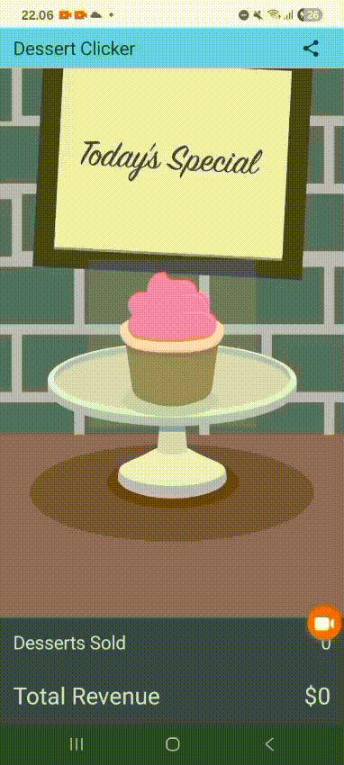

# 🍰 Dessert Clicker App

Dessert Clicker adalah aplikasi sederhana berbasis **Jetpack Compose** yang bertujuan untuk mempelajari konsep **Activity Lifecycle**, state management, dan event handling pada Android.  

Aplikasi ini merupakan bagian dari **tugas praktik Pemrograman Mobile** dengan pacuan materi dari Android codelab berikut:

🔗 https://developer.android.com/codelabs/basic-android-kotlin-compose-activity-lifecycle?hl=id

---

## 📱 Demo Aplikasi

Berikut adalah demo GIF aplikasi Dessert Clicker:

---

## 🧁 Deskripsi Aplikasi

Dessert Clicker bekerja dengan cara:

- Pengguna menekan gambar dessert untuk *menjual* dessert tersebut.
- Setiap dessert memiliki **harga berbeda**.
- Total **penghasilan (revenue)** akan bertambah setiap klik.
- Dessert akan berganti otomatis berdasarkan total jumlah yang telah terjual.
- Background menggunakan **pattern XML** yang dibuat secara manual dengan repeat tile.

---
)
